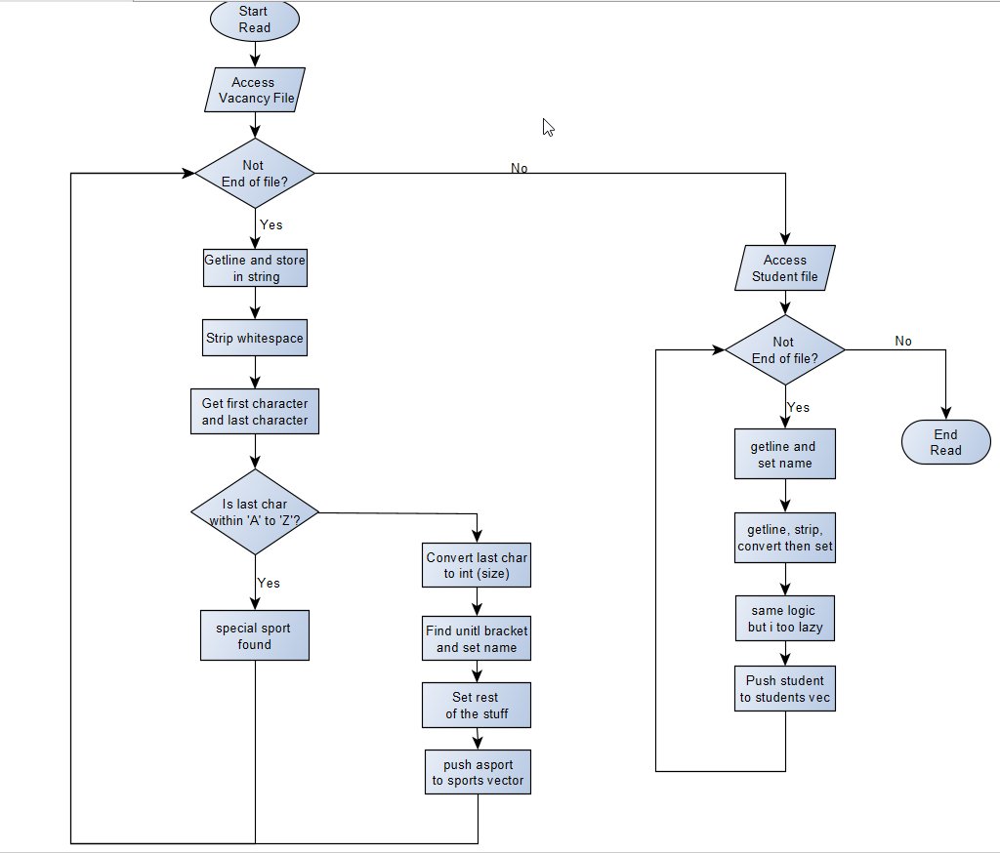
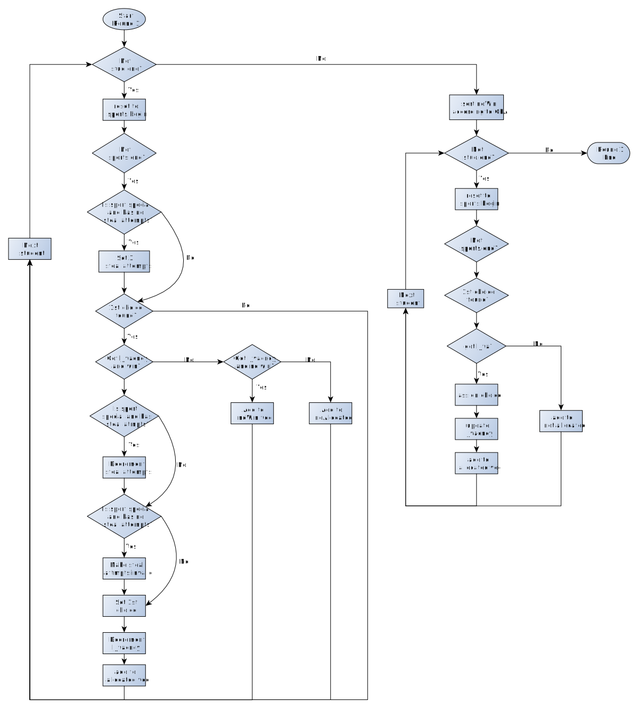

# DSA-q2
DSA project submit by **9 Aug 2021** for free **10 marks!**

## Useful Links:
* [Presentation Slides](https://ichatspedu-my.sharepoint.com/:p:/g/personal/neohtp_20_ichat_sp_edu_sg/ERxy5X8BlaNFm6JUTOZMQcoBGm1sMHXnMUMQ1-vQ5WsKSA?e=p3kW0k)
* [Group Report](https://docs.google.com/document/d/1nf_r0gE0NYXF8mCVTurptTGGjxzFqCf8iK9oEva5cBY/edit?usp=sharing)

## TODO List:
Shifted to [projects](https://github.com/liang799/DSA-q2/projects/1)

## Flowchart
### Reading Files

### Round 1

