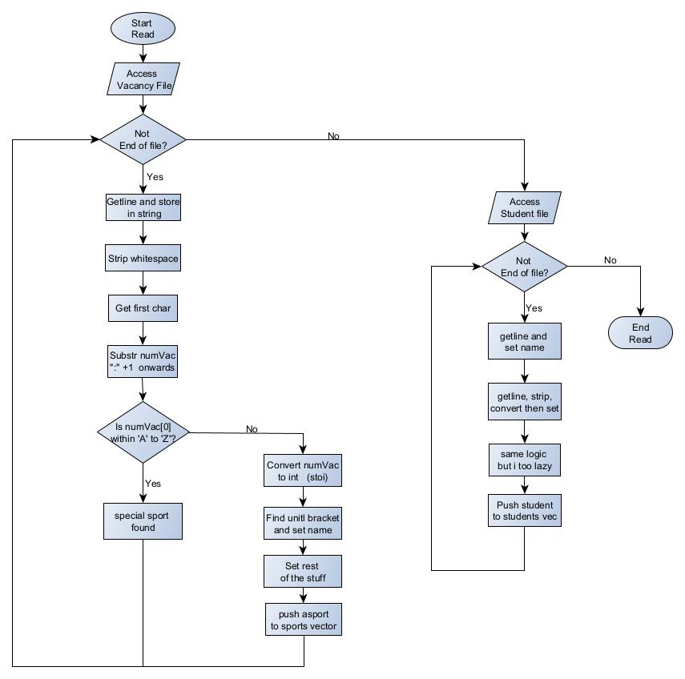
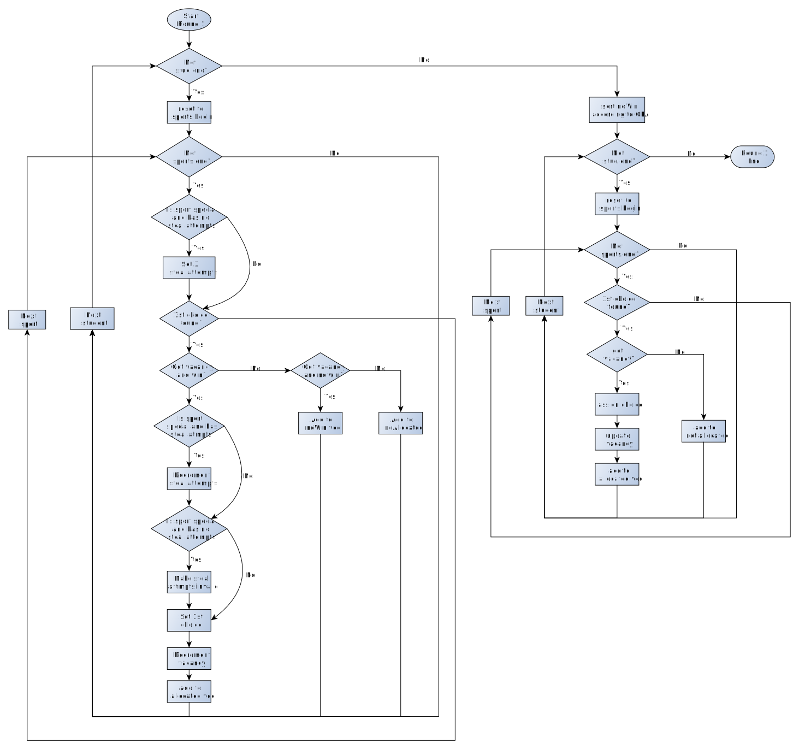
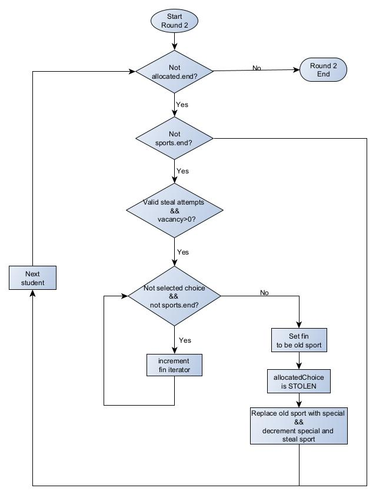
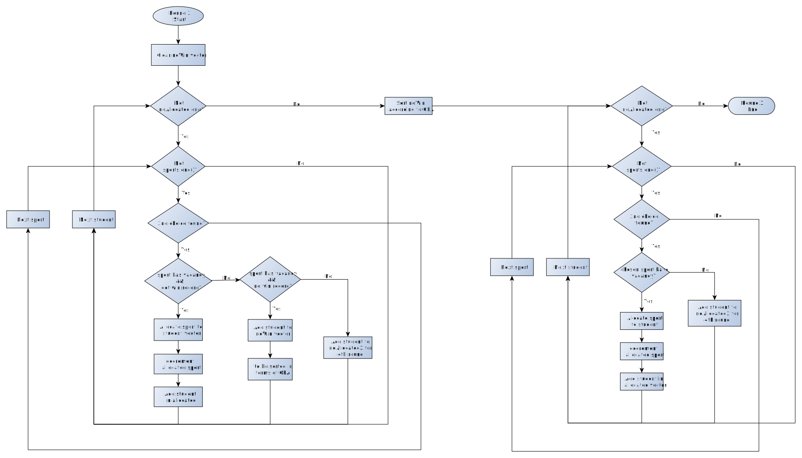
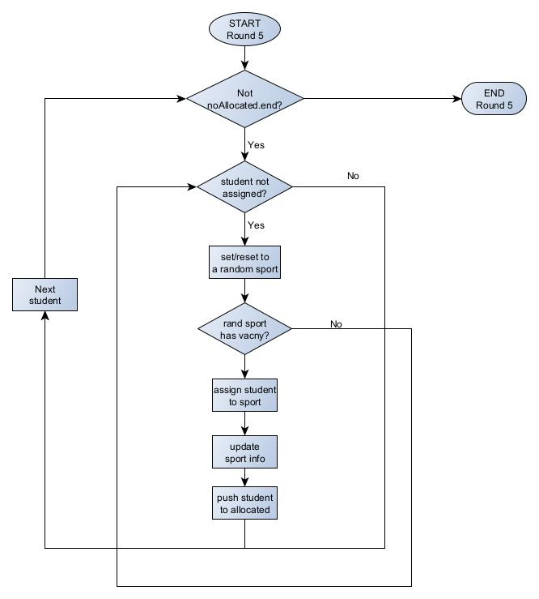

# DSA-q2

## Team Members
* [Harith](https://github.com/Dryices)
* [Me](https://github.com/liang799/)

## Rules for the program
- In Round 1, students are posted to their 1st choice whenever possible. 
- However, every year, EEE allows 1 sport program to make special request to recruit up to 3 
students with history of winning competitions in the sport.
- In Round 2, this special sport is allowed to ‘steal’ students (with winning record) if it has 
been assigned <3 students with winning record.
- In Round 3, the rest of students who have not been allocated will be posted to their 2nd 
choice, if possible.
- In Round 4, the rest of students who have not been allocated will be posted to their 3rd 
choice, if possible.
- In every round, students with winning record will have higher priority. Next, if there is still a 
need to compare, students with higher GPA will have higher priority. 
- Finally, if there are still outstanding students, the program will allocate sport program to 
students randomly, regardless of the student’s choices. 

## Additional features that we added
- [x] Toggle b/w verbose and non-verbose
- [x] Ask user to specify name of text file
- [x] Output data to a new text file called results.csv

## Flowchart
### Reading Files

### Round 1

### Round 2

### Round 3/4

### Round 5

